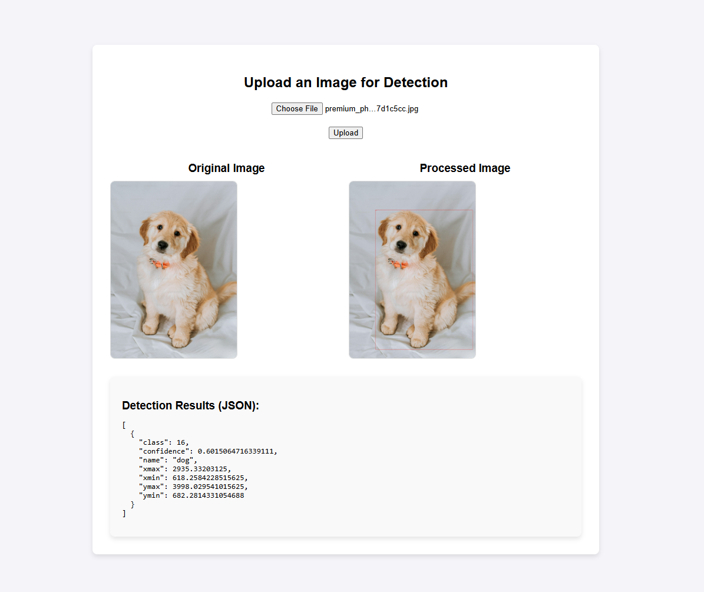

my original email: ozabhargav41@gmail.com
mobile: +91 7567592803

# objectdetection_yolo5
 
# Technical Assessment: Image Upload and Object Detection System

## Project Overview
This document outlines the development of a microservice consisting of two main components: a UI backend service and an AI backend service. The UI backend takes image input from the user, while the AI backend uses a lightweight open-source model for object detection, returning the results in a structured JSON format. The two components communicate seamlessly to provide a comprehensive solution to the user.



---

## Features
- **Frontend:**
  - Intuitive interface for uploading images.
  - Displays both the original and processed images with bounding boxes for detected objects.
  - Shows detailed detection results in JSON format.

- **Backend:**
  - Processes uploaded images using a YOLOv5 model for object detection.
  - Handles Base64-encoded image uploads.
  - Returns processed images and detection details.

---

## File Structure
- **Backend (Flask API):**
  - `app.py` (Backend Logic):
    - Loads the YOLOv5 model.
    - Handles Base64 image uploads.
    - Outputs processed images and detection results.
    - Tested API using Postman with payload format: {\"image\": < base encode image >}.

- **Frontend:**
  - `index.html`:
    - HTML interface for image uploads.
    - Uses JavaScript to send image data to the backend and display results.
  
  - `app.py` (Frontend Logic):
    - Renders the HTML page.
    - Forwards uploaded images to the backend in Base64 format.

---

## Installation and Setup
### Docker Setup
1. Clone the repository.
2. Build and run the Docker container using Docker Compose:
   ```bash
   docker-compose up --build
   ```
3. Access the application via your browser at the specified URL (e.g., `http://localhost:80`).

---

## Step-by-Step Solution Explanation
### Step 1: Setting Up the Backend
- Use Flask for handling API endpoints.
- Load the YOLOv5 model for object detection.
- Define the `/upload_base64` endpoint to process Base64-encoded images and return detection results.

### Step 2: Developing the Frontend
- Use HTML and JavaScript for the user interface.
- Implement image preview and logic to fetch processed results from the backend.

### Step 3: Integration and Communication
- Use the `app.py` frontend logic to send Base64-encoded images to the backend.
- Handle and display detection results and processed images.

### Step 4: Testing
- Upload test images to verify detection results.
- Validate the bounding boxes and generated JSON outputs.


---

## Notes
- Ensure the `BACKEND_URL` in the frontend `app.py` is correctly configured to match the backend container's address and port.
- GPU acceleration is recommended for efficient YOLOv5 processing. If unavailable, the application will fallback to CPU.

---
 
